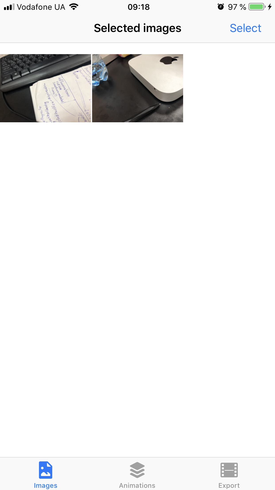
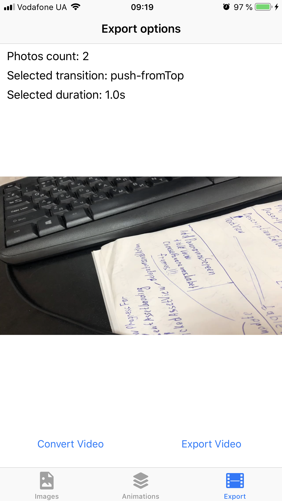

<h1>PhotoToVideoConverter<h1>
<h3>Project Overview<h3>
<h5>This is simple photo-to-video convertion app that use CAAnimation and AVFoundation to get the results that shown below at screen-record.<h5>

 
<h3>Demo-video<h3>
https://www.youtube.com/watch?v=n6s_fvZmr74
